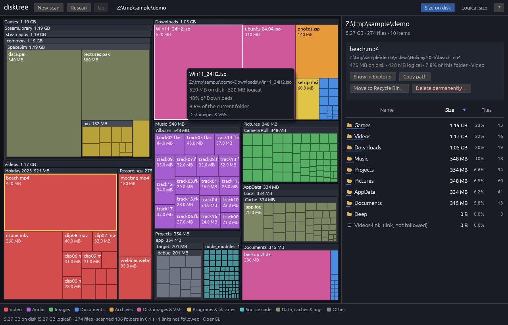

# disktree for Windows

A treemap for finding and removing what fills your disk. A native Windows 11
take on [tobi/disktree](https://github.com/tobi/disktree): scan a drive or
folder, see every file as a rectangle sized by the space it takes, drill in,
and delete what you don't need, safely.



- **Fast, parallel scan** of whole drives: 1,000,000 files took 2–4.5 s on a 4-core test VM.
  Progress is live and the scan can be cancelled.
- **Real on-disk sizes.** "Size on disk" accounts for NTFS compression, CompactOS/WOF, sparse
  files and OneDrive placeholders. Switch to logical size with one click.
- **Links never followed.** Junctions, symlinks and mount points are shown but not
  entered, so there are no loops and nothing is counted twice.
- **Nested, squarified treemap**, coloured by file type, with hover details (path, size,
  % of parent). Double-click to zoom in; use the breadcrumbs, Backspace or the mouse
  Back button to zoom out.
- **Sortable list** of the current folder's children (by size, name or file count).
- **Actions:** Show in Explorer, Copy path, Move to Recycle Bin, Delete permanently.
  After a delete, sizes update in place without a rescan.
- **Single portable `disktree.exe`:** no installer, no Visual C++ runtime, no admin rights.

## Running it

Download `disktree.exe` and double-click it. Pick a drive, click **Browse…**, type a path,
or drop a folder onto the window. You can also start it from a terminal:

```
disktree.exe                        open the drive list
disktree.exe D:\Games               scan a folder right away
disktree.exe --renderer glow        force OpenGL (default: Direct3D 12, then OpenGL)
disktree.exe --print-scan C:\Users  scan without a window and print a summary
```

Folders you cannot read (for example other users' profiles or `System Volume Information`)
are counted as 0 bytes and listed under **"N unreadable"** in the top bar. To read more of
them, run disktree as administrator (right-click → Run as administrator).

### If Windows says "Another program is currently using this file"

Windows shows this when something still holds the exe open. After a download that is
usually Microsoft Defender scanning the new file; wait a few seconds and try again. It can
also be an older copy of disktree still running: check Task Manager for `disktree.exe`
and end it. SmartScreen may warn about an unrecognised app because the exe is not
code-signed; choose **More info → Run anyway**.

### If it doesn't open or it crashes

disktree has no console window, so it reports problems itself:

- **Crash log:** `disktree-crash.log`, written next to `disktree.exe` (or in
  `%LOCALAPPDATA%\disktree\` if that folder isn't writable). A message box tells you
  where it is.
- **Startup log:** `%LOCALAPPDATA%\disktree\disktree.log`, which shows the renderer used
  and any errors.
- **Graphics:** disktree first tries Direct3D 12. It works on virtually every Windows 10/11 PC,
  including VMs and Remote Desktop, where it falls back to Microsoft's WARP software
  renderer. If that fails, disktree tries OpenGL. If both fail, a message box explains why;
  updating the graphics driver or `--renderer glow` usually helps.

## Keyboard and mouse

| Input | Action |
|---|---|
| Click | Select an item (map or list) |
| Double-click / Enter | Open a folder (double-clicking a file opens its folder) |
| Backspace / Alt+Up / mouse Back / middle-click | Up one level |
| Home | Back to the scanned root |
| Up / Down | Move the selection in the list |
| Right-click | Context menu: Open, Show in Explorer, Copy path, Refresh folder, delete |
| **Delete** | Move the selection to the Recycle Bin (asks first) |
| **Shift+Delete** | Delete permanently (asks twice) |
| Ctrl+C | Copy the selected path |
| Ctrl+E | Show in Explorer |
| F5 | Rescan |
| Esc | Clear selection / close dialog / cancel a scan |
| F1 | Shortcut help |

## Delete safety

Deleting is the dangerous part of a tool like this, so disktree is conservative.

- **Recycle Bin by default.** Delete uses the Windows shell (`IFileOperation`, the same engine
  as Explorer), with `FOFX_RECYCLEONDELETE | FOF_ALLOWUNDO | FOF_WANTNUKEWARNING`. If Windows
  can't recycle an item (too big for the Recycle Bin, or a drive without one), *Windows asks
  you* before destroying it; it never silently deletes permanently.
- **Every delete is confirmed.** The dialog shows the name, the full path, the size on disk,
  the logical size and the file count.
- **Permanent delete only with Shift+Delete** (or the "Delete permanently…" button), and it
  needs **two** confirmations. The final button unlocks after a short pause, and Cancel takes
  the spot of the previous button, so a stray double-click cancels instead of deleting.
- **Blocked outright:** drive and share roots, `C:\Windows`, `Program Files`, `ProgramData`,
  `C:\Users`, your profile folder, anything that *contains* one of those, root system items
  (`$Recycle.Bin`, `System Volume Information`, `Recovery`, `pagefile.sys`, …), and links
  (junctions/symlinks are never deleted, because some tools treat a link's target as its
  content).
- **Extra warning plus typing the name** for anything *inside* Windows, Program Files or
  ProgramData, a user's profile folder, and profile folders such as Documents, Desktop,
  Downloads and AppData.
- **The result is checked on disk.** The map only drops an item once it is really gone. If a
  delete was cancelled or partly failed (files in use), disktree re-reads that folder so the
  sizes stay right.
- Paths longer than 260 characters can't go to the Recycle Bin (a Windows limitation). disktree
  says so and offers permanent deletion instead.

These rules live in `src/safety.rs` and are unit-tested. Still: the Recycle Bin is your
undo, so check the path in the dialog.

## What the numbers mean

- **Size on disk** (default) is the space allocated on disk, which is what deleting frees.
  It comes from each directory entry's allocation size. For compressed, sparse and
  WOF-compressed files, disktree asks for the real compressed size (`GetCompressedFileSizeW`).
  OneDrive files that are only in the cloud show 0.
- **Logical size** is the file length, what Explorer shows as "Size".
- **Links:** junctions, symbolic links and mount points are shown as 0-byte entries and
  never entered. Cloud (OneDrive), dedup and WOF reparse points are real data and *are*
  counted. As a second safety net, each folder is identified by volume serial and file ID,
  and a folder reached twice (for example through a network redirector that doesn't report
  links) is counted only once.
- **Hard links** are counted once per link, as in any directory walk. This mostly inflates
  `C:\Windows\WinSxS`.
- Alternate data streams are not counted.

## Building

### On Windows

Install Rust from <https://rustup.rs>, then:

```
cargo build --release          # target\release\disktree.exe
cargo test --lib
```

### Cross-compiling from Linux or macOS (how the attached exe was built)

```bash
rustup target add x86_64-pc-windows-msvc
cargo install cargo-xwin          # fetches the MSVC CRT and Windows SDK on first use
sudo apt install llvm clang lld   # llvm-rc compiles the icon/manifest resources
./scripts/build-windows.sh        # -> dist/disktree.exe
```

The C runtime is linked statically (`.cargo/config.toml`), so the exe depends only on
DLLs that ship with Windows. The embedded manifest (`assets/disktree.exe.manifest`) sets
per-monitor-v2 DPI awareness, `longPathAware`, `asInvoker` (no UAC prompt) and themed
common controls.

`.github/workflows/ci.yml` runs the tests and builds the exe both natively on
`windows-latest` and cross-compiled from Ubuntu.

### Tests

```bash
cargo test --lib
```

The 44 unit tests cover:

- size aggregation, removal and re-grafting in the tree
- squarified and nested treemap layout (exact proportions, no overlaps, budgets)
- the scanner: nesting, links, loops, unreadable folders, cancellation, deep nesting
- the delete safety rules, delete outcomes, categories and formatting

Windows-only tests cover junctions, paths over 260 characters and names ending in dots or
spaces. The Windows test binary can also run under wine:

```bash
cargo xwin test --lib --no-run --release --target x86_64-pc-windows-msvc
wine target/x86_64-pc-windows-msvc/release/deps/disktree-*.exe
```

## Why egui (and not GPUI)

The original disktree uses [GPUI](https://www.gpui.rs/), Zed's UI framework. On Windows,
GPUI support is young, the framework evolves with Zed's needs, and it has little track
record outside Zed, which is a poor fit for a small standalone tool that must just
work on any Windows 11 PC.

disktree uses [egui/eframe](https://github.com/emilk/egui) instead. It is mature on
Windows, cross-compiles cleanly, and runs on two independent graphics backends:

- **wgpu → Direct3D 12**, which has a software fallback, so it works in VMs and over RDP;
- **OpenGL**, as a second chance.

The treemap is a single custom-painted widget. The list is virtualised, so a folder with
100,000 entries costs the same to draw as one with 10.

## Project layout

```
src/
  main.rs       entry point: CLI, renderer selection and fallback, GUI subsystem
  crash.rs      panic hook: crash log next to the exe + message box
  diag.rs       startup log in %LOCALAPPDATA%\disktree
  app/          the egui UI (state and actions, screens, browser, dialogs, widgets)
  lib.rs        testable core:
  scan.rs         parallel scan (rayon), cancellation, dedupe by file ID
  fsread.rs       one directory at a time: GetFileInformationByHandleEx(FileFullDirectoryInfo)
                  with \\?\ paths on Windows; std::fs elsewhere
  tree.rs         flat u32-indexed arena with rolled-up sizes, remove() and graft()
  treemap.rs      squarified + nested layout, hit testing
  safety.rs       what may be deleted and how carefully
  ops.rs          IFileOperation / SHFileOperation delete, Explorer, drives, message box
assets/         icon, manifest, resource script
scripts/        build-windows.sh, make_icon.py
```

## Limitations

- No NTFS MFT fast path (the original TUI has one for elevated sessions). The parallel
  directory walk is fast enough for most drives but is bounded by the file system's metadata
  speed.
- Hard links are counted once per link.
- One item is deleted at a time; there is no multi-select yet.

License: MIT.
